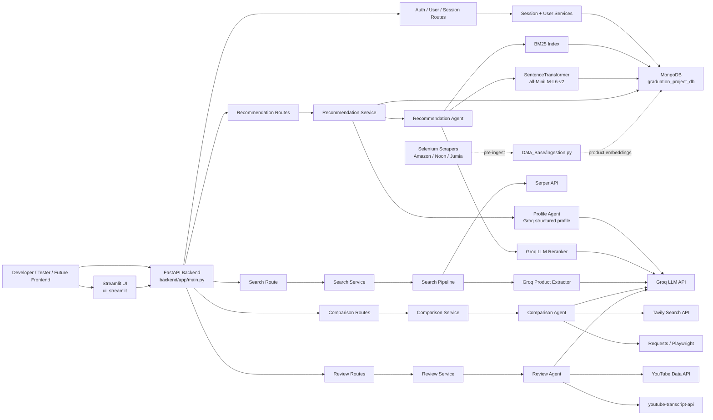

# 🛒 Agentic Shopping Assistant

> A Python-powered shopping intelligence system — combining FastAPI, LLM agents, semantic search, and real-time web lookup to help users discover, compare, and evaluate products through natural conversation.

---

## Table of Contents

- [Overview](#overview)
- [Architecture](#architecture)
- [Tech Stack](#tech-stack)
- [Project Structure](#project-structure)
- [Quick Start](#quick-start)
- [Running the System](#running-the-system)
- [Environment Variables](#environment-variables)
- [System Flows](#system-flows)
- [Agents & Core Logic](#agents--core-logic)
- [API Reference](#api-reference)
- [Development Guide](#development-guide)
- [Known Limitations](#known-limitations)
- [Troubleshooting](#troubleshooting)

---

## Overview

Agentic Shopping Assistant is a multi-agent AI system that transforms natural language shopping requests into structured, ranked product recommendations — and supports follow-up conversation to refine results.

**What a user can do:**

- Describe what they want to buy in plain language
- Receive ranked product recommendations from an indexed database
- Refine recommendations through follow-up chat
- Compare two products using live web search and scraped context
- Analyze product reviews using YouTube transcripts and sentiment analysis
- Run a live product search independent of the local product database

**How it fits together:**

| Layer | Role |
|---|---|
| **FastAPI** | Stable HTTP API — the canonical integration surface |
| **Streamlit UI** | Temporary developer UI for testing backend flows |
| **MongoDB** | Persistent store for users, sessions, products, messages, cache |
| **LLM Agents (Groq)** | Profile extraction, intent routing, reranking, review analysis, comparison |
| **Scrapers + Ingestion** | Collect and embed product records for recommendation retrieval |

> **Note on legacy files:** `main.py` at the root and `agents/recommendation/main.py` are legacy CLI experiments — not the canonical entrypoint. The canonical backend is `backend/app/main.py`.

---

## Architecture



**Runtime layers:**

- **API layer** — `backend/app/routes/*` — HTTP endpoints and Pydantic schemas
- **Service layer** — `backend/app/services/*` — rate limiting, caching, session management, agent orchestration
- **Agent layer** — `agents/*` — domain logic for profiling, recommendation, comparison, and review analysis
- **Search pipeline** — `search_pipeline/*` — Serper + Groq live product search, used by `/search/`
- **Persistence layer** — `Data_Base/*` — MongoDB collection wrappers, repositories, indexes
- **Scraping / ingestion** — `scrapers/*` + `Data_Base/ingestion.py` — product collection and embedding
- **Developer UI** — `ui_streamlit/*` — Streamlit interface that mirrors likely frontend flows

---

## Tech Stack

**Backend**
- Python, FastAPI, Uvicorn, Pydantic, PyMongo, python-dotenv

**AI & Retrieval**
- Groq API via `groq` and `langchain-groq`
- LangChain Core output parsing
- Sentence Transformers (`all-MiniLM-L6-v2`)
- FAISS CPU, BM25 (`rank-bm25`)
- NumPy, scikit-learn, SciPy

**Search, Reviews & Scraping**
- Serper API (product/web search)
- Tavily API (comparison search)
- YouTube Data API + `youtube-transcript-api`
- Requests, BeautifulSoup, Playwright, Selenium, webdriver-manager

**UI**
- Streamlit

**Storage**
- MongoDB Atlas (or any compatible URI)
- Database: `graduation_project_db`
- Primary product collection: `products_raw`

---

## Project Structure

```
.
├── backend/
│   └── app/
│       ├── main.py                  # FastAPI entrypoint ← canonical
│       ├── routes/                  # HTTP route modules
│       ├── schemas/                 # Pydantic request/response contracts
│       ├── services/                # Orchestration, sessions, caching, auth, rate limits
│       └── tests/                   # Backend unit tests and smoke scripts
│
├── agents/
│   ├── profile/                     # LLM profile extraction agent
│   ├── recommendation/              # Recommendation retrieval, ranking, chat refinement
│   ├── comparison/                  # Web-search-based comparison agent
│   ├── reviews/                     # YouTube review analysis agent
│   └── shared/                      # Shared product-name cleanup helpers
│
├── Data_Base/
│   ├── db.py                        # Mongo client, collection accessors, indexes
│   ├── ingestion.py                 # Product validation, embedding, upsert pipeline
│   ├── *_repo.py                    # Mongo repository functions
│   └── config.py                    # Mongo DB and collection configuration
│
├── search_pipeline/
│   ├── pipeline.py                  # Search → extract → clean → rank orchestration
│   ├── search.py                    # Serper client
│   ├── extractor.py                 # Groq JSON product extractor
│   ├── cleaner.py                   # Product normalization, link cleanup, dedupe
│   ├── ranker.py                    # Lexical ranking
│   └── test_pipeline.py             # Runnable smoke tests
│
├── scrapers/
│   ├── amazon.py                    # Amazon Egypt scraper
│   ├── noon.py                      # Noon Egypt scraper
│   ├── jumia.py                     # Jumia Egypt scraper
│   ├── base.py                      # Selenium/Brave driver and shared helpers
│   └── run_scraper.py               # Multi-site scraper runner
│
├── ui_streamlit/
│   ├── app.py                       # Streamlit entrypoint
│   ├── pages/                       # Auth, recommendation, comparison, review, search pages
│   ├── components/                  # Reusable Streamlit renderers
│   └── services/                    # API client and session-state helpers
│
├── tools/
│   ├── product_classifier.py        # Product type classifier
│   ├── reset_db.py                  # Legacy DB reset utility
│   └── logger.py                    # Logger helper
│
├── main.py                          # Legacy CLI entrypoint — not canonical
├── requirements.txt
├── .env                             # Local secrets — gitignored
└── README.md
```

**Key files at a glance:**

| File | Purpose |
|---|---|
| `backend/app/main.py` | FastAPI app, router registration, Mongo init/shutdown |
| `backend/app/services/recommendation_service.py` | Starts and continues recommendation sessions |
| `backend/app/services/search_service.py` | Stateless live search with 10-min memory cache |
| `backend/app/services/comparison_service.py` | Wraps `ComparisonAgent`, persists and caches comparisons |
| `backend/app/services/review_service.py` | Wraps `ReviewAgent`, persists and caches reviews |
| `backend/app/services/session_service.py` | User creation, session creation, message persistence |
| `Data_Base/db.py` | Mongo client lifecycle and index creation |
| `Data_Base/ingestion.py` | Validates, embeds, and upserts product records |
| `agents/recommendation/agent.py` | BM25 retrieval, semantic scoring, LLM reranking |
| `ui_streamlit/services/api_client.py` | Living map of all backend API calls |

---

## Quick Start

```powershell
# 1. Create and activate a virtual environment
python -m venv venv
.\venv\Scripts\Activate.ps1

# 2. Install dependencies
pip install -r requirements.txt

# 3. Install Playwright browser runtime (used by comparison agent)
python -m playwright install chromium

# 4. Create .env with required keys (see Environment Variables section)

# 5. Start the backend
uvicorn backend.app.main:app --reload --host 127.0.0.1 --port 8000

# 6. In a second terminal, start the developer UI
streamlit run ui_streamlit/app.py
```

| Service | URL |
|---|---|
| API health check | `http://127.0.0.1:8000/` |
| Swagger / interactive docs | `http://127.0.0.1:8000/docs` |
| Streamlit developer UI | `http://localhost:8501` |

---

## Running the System

### Backend API

```powershell
uvicorn backend.app.main:app --reload --host 127.0.0.1 --port 8000
```

Expected health response:

```json
{ "status": "ok" }
```

**Important startup behavior:**
- `init_collections()` runs automatically on startup — MongoDB indexes are created.
- `SearchPipeline()` is instantiated at import time in `search_service.py`, so `SERPER_API_KEY` must be present even if you don't use `/search/`.

### Streamlit Developer UI

```powershell
streamlit run ui_streamlit/app.py
```

The Streamlit UI is a **temporary developer/mock frontend** — not a production interface. It simulates common flows (auth, recommendation, comparison, review, search, session restore) and is the best behavioral reference for anyone building a real frontend.

### Standalone Search Pipeline

```powershell
# CLI usage
python -m search_pipeline "gaming laptop" --search-limit 10 --top-k 5

# Smoke tests
python search_pipeline/test_pipeline.py

# Live mode with custom query
python search_pipeline/test_pipeline.py --live --query "best gaming laptop under 1500"
```

### Backend Unit Tests

```powershell
python -m unittest discover backend/app/tests
```

> Some tests import modules that construct API clients at import time. Keep `.env` populated, or set dummy keys when running tests that mock network calls.

---

## Environment Variables

Create a `.env` file at the repository root. **Do not commit this file** — it is already in `.gitignore`.

```env
MONGO_URI_CLOUD=mongodb+srv://...
GROQ_API_KEY=...
SERPER_API_KEY=...
YOUTUBE_API_KEY=...
TAVILY_API_KEY=...

# Optional Streamlit settings
SHOPPING_ASSISTANT_BACKEND_URL=http://127.0.0.1:8000
SHOPPING_ASSISTANT_TIMEOUT_SECONDS=120
```

| Variable | Required | Used By | Purpose |
|---|---|---|---|
| `MONGO_URI_CLOUD` | ✅ Always | `Data_Base/config.py` | MongoDB connection string |
| `GROQ_API_KEY` | ✅ For agents | Profile, recommendation, comparison, review, search | All LLM calls |
| `SERPER_API_KEY` | ✅ For backend startup | `search_pipeline/search.py` | Serper.dev shopping/organic search |
| `YOUTUBE_API_KEY` | ✅ For review flow | `agents/reviews/youtube_service.py` | YouTube video search |
| `TAVILY_API_KEY` | ✅ For comparison flow | `agents/comparison/agent.py` | Web search for comparison pages |
| `SHOPPING_ASSISTANT_BACKEND_URL` | ⬜ Optional | Streamlit UI | Defaults to `http://127.0.0.1:8000` |
| `SHOPPING_ASSISTANT_TIMEOUT_SECONDS` | ⬜ Optional | Streamlit UI | Defaults to `120` |

**MongoDB collections used:**

`products_raw`, `user_profiles`, `users`, `sessions`, `messages`, `api_cache`, `user_feedback`, `search_sessions`, `search_history`

---

## System Flows

### Auth & Session Setup

1. Client creates a guest user via `POST /users/guest` or registers/logs in via `/auth/*`
2. Backend stores or updates the user in MongoDB
3. The returned `user_id` is included in all subsequent requests
4. **Note:** No JWT/token layer exists yet — the API trusts the supplied `user_id` directly

### Recommendation Flow

```
POST /recommendation/start
  → ProfileAgent extracts structured UserProfile (Groq)
  → profile_adapter converts profile to recommendation fields
  → RecommendationAgent builds BM25 + semantic query
  → BM25Index retrieves candidates from products_raw
  → ProductScorer scores by semantic similarity + price fit
  → LLMReranker selects best candidates (Groq)
  → Diversity filter applied → top results returned
  → Session + messages persisted to MongoDB
```

### Recommendation Chat Refinement

```
POST /recommendation/chat
  → RecommendationIntentRouter classifies intent (Groq)
      budget refinement | preference change | brand filter
      | explanation | general Q&A | new search
  → Reruns recommendations, filters results, answers inline,
    or opens a new session
  → Updated state and messages persisted
```

### Live Search Flow

```
POST /search/
  → Rate limit check + user existence check
  → Normalized query checked against 10-min memory cache
  → Cache miss → SearchPipeline runs:
      Serper shopping search
      → organic fallback if empty
      → Groq extraction
      → cleaning + deduplication + ranking
  → Results cached in memory
  → Search session + history persisted to MongoDB
```

### Comparison Flow

```
POST /comparison/start
  → ComparisonAgent parses two product names
  → Shared extractor normalizes noisy titles
  → Tavily searches for comparison pages
  → Requests + Playwright fetch page content
  → BeautifulSoup cleans text
  → Groq generates structured comparison JSON
  → Result + state persisted; follow-ups use stored page context
```

### Review Flow

```
POST /review/start
  → ReviewAgent extracts + cleans product name
  → YouTube Data API searches for review videos
  → youtube-transcript-api fetches transcripts
  → Groq analyzes transcripts → JSON summary
      (summary, sentiment, pros, cons, value, insights, best-for)
  → Result + state persisted; follow-ups use stored review data
```

### Product Ingestion Flow

```
scrapers/* collect raw product records
  → Data_Base/ingestion.py validates required fields
  → tools/product_classifier.py classifies product type
  → SentenceTransformers generates embeddings (new records only)
  → MongoDB upserts by normalized product.link
  → products_raw feeds recommendation retrieval
```

---

## Agents & Core Logic

### Profile Agent

**Location:** `agents/profile/`

Converts a free-form shopping request into a fully structured `UserProfile`. Uses `llama-3.3-70b-versatile` via `langchain-groq` with a `PydanticOutputParser`. Missing details are inferred — the model does not ask follow-up questions.

```python
run_profile_agent(user_input: str, history: list | None, current_profile: UserProfile | None)
# → ProfileAgentOutput
```

### Recommendation Agent

**Location:** `agents/recommendation/`

Recommends products from MongoDB using an adapted profile. Builds semantic and BM25 query text, retrieves candidates, scores by semantic similarity and price fit, then LLM-reranks with Groq. Applies diversity filtering before returning results.

```python
RecommendationAgent(user_id).recommend(profile: dict, top_k: int = 4)
# → List of product dicts with title, price, link, scores
```

> Requires products in `products_raw` with `product.embedding` populated.

### Recommendation Chat Handler & Intent Router

**Location:** `agents/recommendation/chat_handler.py`, `intent_router.py`

Interprets follow-up messages and routes to the correct handling path:

| Intent | Action |
|---|---|
| Budget / preference / brand change | Reruns `RecommendationAgent` |
| Explanation request | Answers from conversation context |
| General question | Answers with Groq + history |
| New product search | Opens a fresh session |

### Search Pipeline

**Location:** `search_pipeline/`

Stateless live product search, independent of the local product database. Runs Serper shopping search → organic fallback → Groq extraction → cleaning → lexical ranking.

```python
SearchPipeline().run(query="gaming laptop", search_limit=10, top_k=5)
# → Canonical product list with rank, title, price, link, source, scores
```

### Comparison Agent

**Location:** `agents/comparison/agent.py`

Parses two products from a prompt like `"iphone 15 vs galaxy s24"`, normalizes names, searches Tavily, fetches and cleans web pages, then generates a structured Groq comparison. Supports follow-up Q&A from stored page context via `to_state()` / `from_state()`.

### Review Agent

**Location:** `agents/reviews/`

Parses a review request, searches YouTube, fetches video transcripts, and uses Groq to produce a JSON review summary (sentiment score, pros, cons, value-for-money, insights, best-fit). Stateful — supports follow-up questions from stored review data.

### Shared Product Name Extractor

**Location:** `agents/shared/product_name_extractor.py`

Cleans noisy e-commerce titles into concise product names. Uses Groq when available; falls back to rule-based cleaning. Used by the comparison agent, review agent, and YouTube service.

---

## API Reference

### Endpoint Summary

| Method | Path | Purpose |
|---|---|---|
| `GET` | `/` | Health check |
| `POST` | `/users/guest` | Create a guest user |
| `POST` | `/auth/register` | Register with email/password |
| `POST` | `/auth/login` | Login with email/password |
| `GET` | `/auth/me?user_id=...` | Fetch current user identity |
| `POST` | `/recommendation/start` | Start recommendation session |
| `POST` | `/recommendation/chat` | Continue recommendation session |
| `POST` | `/comparison/start` | Start comparison session |
| `POST` | `/comparison/chat` | Continue comparison session |
| `POST` | `/review/start` | Start review session |
| `POST` | `/review/chat` | Continue review session |
| `POST` | `/search/` | Stateless live product search |
| `GET` | `/sessions/?user_id=...` | List user sessions |
| `GET` | `/sessions/{session_id}` | Get session with agent state |
| `GET` | `/sessions/{session_id}/messages` | Get session messages |
| `POST` | `/sessions/{session_id}/close` | Close a session |

All stateful flows return a consistent envelope:

```json
{
  "status": "success",
  "type": "recommendations",
  "message": "Here are some products for you",
  "session_id": "session_abc123",
  "data": {}
}
```

---

### Auth Examples

**Create guest user**

```http
POST /users/guest
```

```json
{
  "status": "success",
  "data": { "user_id": "user_ab12cd34", "mode": "guest" }
}
```

**Register**

```http
POST /auth/register
Content-Type: application/json

{
  "email": "dev@example.com",
  "password": "StrongPass123",
  "display_name": "Dev User"
}
```

---

### Recommendation Examples

**Start session**

```http
POST /recommendation/start
Content-Type: application/json

{
  "user_id": "user_ab12cd34",
  "message": "I need a gaming laptop under 50000 EGP"
}
```

```json
{
  "status": "success",
  "type": "recommendations",
  "session_id": "session_abc123def0",
  "data": {
    "products": [
      {
        "title": "Example Gaming Laptop",
        "price": 48000,
        "link": "https://example.com/product",
        "category": "Computers",
        "semantic_score": 0.71,
        "price_score": 0.98,
        "final_score": 0.82
      }
    ]
  }
}
```

**Chat follow-up**

```http
POST /recommendation/chat
Content-Type: application/json

{
  "user_id": "user_ab12cd34",
  "session_id": "session_abc123def0",
  "message": "make it cheaper"
}
```

Possible response types: `recommendations` (updated products), `message` (explanation), `reset` (new session created).

---

### Search Example

```http
POST /search/
Content-Type: application/json

{
  "user_id": "user_ab12cd34",
  "message": "best wireless earbuds"
}
```

```json
{
  "status": "success",
  "type": "search",
  "data": {
    "products": [
      {
        "rank": 1,
        "title": "Example Earbuds",
        "price": 1999,
        "currency": "EGP",
        "link": "https://example.com/item",
        "source": "example",
        "relevance_score": 0.91
      }
    ]
  }
}
```

---

### Comparison Example

```http
POST /comparison/start
Content-Type: application/json

{
  "user_id": "user_ab12cd34",
  "message": "iphone 15 vs galaxy s24"
}
```

```json
{
  "status": "success",
  "type": "comparison",
  "session_id": "session_compare123",
  "data": {
    "summary": "Short comparison summary.",
    "comparison_table": [
      { "feature": "Camera", "product_1": "Strong video", "product_2": "Flexible zoom" }
    ],
    "key_differences": ["..."],
    "recommendation": {
      "product_1": ["Choose for iOS ecosystem"],
      "product_2": ["Choose for Android flexibility"]
    },
    "sources": [{ "url": "https://example.com/comparison" }]
  }
}
```

---

### Rate Limit Error Shape

```json
{
  "message": "Rate limit exceeded",
  "limit": 20,
  "retry_after_seconds": 42
}
```

---

## Development Guide

### Adding a New Backend Feature

1. Add request/response schemas in `backend/app/schemas/`
2. Add the HTTP route in `backend/app/routes/`
3. Put orchestration logic in `backend/app/services/`
4. Keep direct MongoDB calls inside `Data_Base/*_repo.py`
5. Register the router in `backend/app/main.py`
6. Add tests under `backend/app/tests/`
7. Add an API client function in `ui_streamlit/services/api_client.py`

### Adding a New Stateful Agent

1. Implement the agent under `agents/<agent_name>/`
2. Provide `to_state()` / `from_state()` for follow-up chat continuity
3. Use `session_service` for all message and state persistence
4. Return consistent envelopes: `status`, `type`, `message`, `session_id`, `data`
5. Add rate limits in the service layer; cache deterministic calls with `cache_service`

### For Frontend Developers

There is no production frontend in this repository. Use `ui_streamlit/services/api_client.py` as the living API call reference.

**Integration rules:**
- Create/authenticate a user first and store `user_id`
- Store `session_id` for all stateful flows
- Use `/*/start` to open sessions; `/*/chat` for follow-ups
- Use `/sessions/` endpoints to build history and restore sessions

**Before deploying a browser frontend, add:**
- CORS middleware to `backend/app/main.py`
- A proper authentication layer (JWT/session cookies) — the current API trusts `user_id` directly

### Adding a New Product Source

1. Add a scraper module under `scrapers/`
2. Implement `get_all_products()`, `get_product_extra_info()`, and `normalize_product()`
3. Build records using `scrapers/base.py`
4. Ingest via `Data_Base/ingestion.py`
5. Ensure product links are stable and unique
6. Verify records include enough `details_text` for embedding quality

### Before Committing

```powershell
python -m unittest discover backend/app/tests
python search_pipeline/test_pipeline.py
```

---

## Known Limitations

| Area | Limitation |
|---|---|
| **Auth** | No JWT/session cookie layer — backend trusts `user_id` directly |
| **CORS** | Not configured — browser frontends on another origin will fail |
| **Rate limiting** | In-memory only — resets on restart, not shared across workers |
| **Search cache** | In-memory only — not shared across processes |
| **Recommendations** | Requires pre-ingested `products_raw` with embeddings — empty DB = no results |
| **Reranker** | Receives mostly title/price; some detail fields dropped before `LLMReranker` |
| **Backend startup** | `SearchPipeline()` instantiated at import time — missing `SERPER_API_KEY` breaks startup even if `/search/` is unused |
| **Case sensitivity** | Legacy files import `Data_base`; folder is `Data_Base` — fails on Linux/macOS |
| **Scrapers** | Hardcoded Brave path; 1-page limit; imports `Data_base` (case bug) |
| **Product classifier** | Phrase-keyword matching may miss multi-word categories |
| **Comparison** | Depends on public web pages — may fail on blocked or dynamic sites |
| **Reviews** | Skips videos without English transcripts |
| **LLM parsing** | Defensive but still depends on model returning valid JSON |
| **Migrations** | No formal migration system for Mongo indexes or schema changes |

---

## Troubleshooting

### `Missing MONGO_URI_CLOUD`

Add to `.env` and restart Uvicorn:

```env
MONGO_URI_CLOUD=mongodb+srv://...
```

### `SERPER_API_KEY is required` on startup

`search_service.py` creates `SearchPipeline()` at import time. Add the key and restart:

```env
SERPER_API_KEY=...
```

### Streamlit can't connect to backend

Ensure the backend is running, then:

```powershell
uvicorn backend.app.main:app --reload --host 127.0.0.1 --port 8000
$env:SHOPPING_ASSISTANT_BACKEND_URL = "http://127.0.0.1:8000"
streamlit run ui_streamlit/app.py
```

### Recommendations return empty results

1. Check `products_raw` in MongoDB — is it populated?
2. Confirm records have `product.title`, `product.price`, `product.link`, `product.details_text`, `product.product_type`, and `product.embedding`
3. Run ingestion for a known product category
4. Inspect `BM25Index.build()` and `BM25Index.search()` output directly

### Playwright errors during comparison

```powershell
python -m playwright install chromium
```

### `Could not fetch reviews`

- Check `YOUTUBE_API_KEY` is valid and quota is not exceeded
- Verify that transcripts exist for the returned video IDs
- Note: only videos with English transcripts are processed

### `ModuleNotFoundError: No module named 'Data_base'`

Legacy scripts use `Data_base` instead of `Data_Base`. Use canonical backend imports, or fix the casing before running on case-sensitive (Linux/macOS) systems.

### Selenium scraper won't start

- Verify Brave is installed at `C:\Program Files\BraveSoftware\Brave-Browser\Application\brave.exe`
- Or update `create_brave_driver()` in `scrapers/base.py` to point to your browser
- Run in visible browser mode for debugging

### FAISS / Torch / Sentence Transformers install errors

- Try Python 3.11 or 3.12 — some wheels are unavailable for Python 3.13
- Recreate the virtual environment
- Upgrade `pip` before installing: `pip install --upgrade pip`
