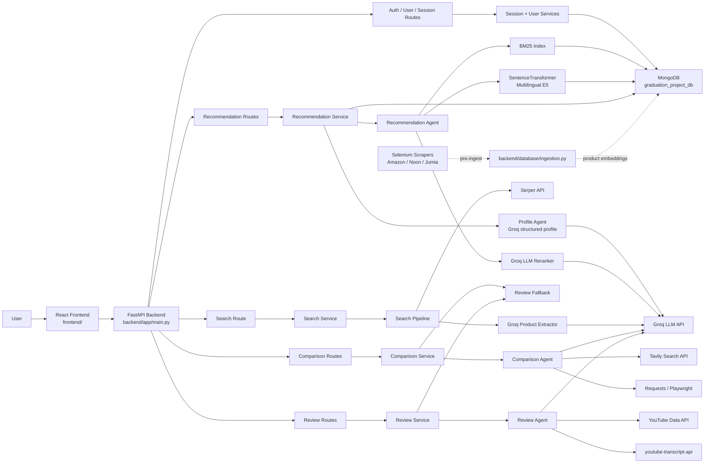

<div align="center">


# 🛒 Agentic Shopping Assistant

**A multi-agent AI system that turns natural language into personalized, ranked product recommendations — with live web search, deep comparison, and YouTube-powered review analysis.**

[Overview](#-overview) · [Architecture](#️-architecture) · [Tech Stack](#-tech-stack) · [Quick Start](#-quick-start) · [System Flows](#-system-flows) · [Agents & Core Logic](#-agents--core-logic) · [API Reference](#-api-reference) · [Development Guide](#-development-guide)

</div>

---

## 📌 Overview

Agentic Shopping Assistant is a production-grade, full-stack AI application built as a graduation project. It chains together specialized LLM agents, hybrid semantic retrieval, and real-time web intelligence to help users discover, compare, and evaluate products — all through natural conversation.

The system is backed by a **React + TypeScript** web interface with **full English and Arabic (RTL) support**, and is designed to handle the entire shopping journey: from an initial "I need a laptop under 50,000 EGP" all the way through follow-up refinements, side-by-side comparisons, and sentiment-based review summaries.

**What a user can do:**

- Describe what they want to buy in plain language and receive ranked recommendations
- Refine results through multi-turn follow-up conversation
- Compare two products using live web search and deep content scraping
- Analyze product reviews from YouTube transcripts with sentiment, pros/cons, and value metrics
- Run a real-time product search completely independent of the local database

**How it fits together:**

| Layer | Role |
|---|---|
| **FastAPI Backend** | Stable HTTP API — the canonical integration surface |
| **React Frontend** | Production web interface built with TypeScript, Vite, and TailwindCSS |
| **MongoDB** | Persistent store for users, sessions, products, messages, and cache |
| **LLM Agents (Groq)** | Specialized agents for profiling, recommendation, comparison, and review analysis |
| **Scrapers + Ingestion** | Collect and embed product records for recommendation retrieval |

---

## 🏗️ Architecture


```mermaid
flowchart LR
    User["User"] --> Frontend["React Frontend\nfrontend/"]
    Frontend --> API["FastAPI Backend\nbackend/app/main.py"]

    API --> AuthRoutes["Auth / User / Session Routes"]
    API --> RecRoutes["Recommendation Routes"]
    API --> SearchRoutes["Search Route"]
    API --> CompareRoutes["Comparison Routes"]
    API --> ReviewRoutes["Review Routes"]

    AuthRoutes --> SessionService["Session + User Services"]
    RecRoutes --> RecService["Recommendation Service"]
    SearchRoutes --> SearchService["Search Service"]
    CompareRoutes --> CompareService["Comparison Service"]
    ReviewRoutes --> ReviewService["Review Service"]

    SessionService --> Mongo["MongoDB\ngraduation_project_db"]

    RecService --> ProfileAgent["Profile Agent\nGroq structured profile"]
    RecService --> RecAgent["Recommendation Agent"]
    ProfileAgent --> Groq["Groq LLM API"]
    RecAgent --> BM25["BM25 Index"]
    RecAgent --> Embedder["SentenceTransformer\nMultilingual E5"]
    RecAgent --> Reranker["Groq LLM Reranker"]
    BM25 --> Mongo
    Embedder --> Mongo
    Reranker --> Groq
    RecService --> Mongo

    SearchService --> SearchPipeline["Search Pipeline"]
    SearchPipeline --> Serper["Serper API"]
    SearchPipeline --> SearchExtractor["Groq Product Extractor"]
    SearchExtractor --> Groq

    CompareService --> ComparisonAgent["Comparison Agent"]
    CompareService --> Fallback["Comparison Fallback"]
    ComparisonAgent --> Tavily["Tavily Search API"]
    ComparisonAgent --> WebPages["Requests / Playwright"]
    ComparisonAgent --> Groq

    ReviewService --> ReviewAgent["Review Agent"]
    ReviewService --> Fallback["Review Fallback"]
    ReviewAgent --> YouTube["YouTube Data API"]
    ReviewAgent --> Transcripts["youtube-transcript-api"]
    ReviewAgent --> Groq

    Scrapers["Selenium Scrapers\nAmazon / Noon / Jumia"] -. pre-ingest .-> Ingestion["backend/database/ingestion.py"]
    Ingestion -. product embeddings .-> Mongo
```

**Runtime layers:**

| Layer | Location | Responsibility |
|---|---|---|
| **Frontend** | `frontend/` | React + TypeScript + Vite UI with i18n and RTL |
| **API** | `backend/app/routes/` | HTTP endpoints, request validation (Pydantic) |
| **Services** | `backend/app/services/` | Rate limiting, caching, session management, agent orchestration |
| **Agents** | `backend/agents/` | Domain logic: profiling, recommendation, comparison, reviews |
| **Search Pipeline** | `backend/search_pipeline/` | Serper + Groq live product discovery |
| **Persistence** | `backend/database/` | MongoDB repos, ingestion pipeline, cache management |
| **Scrapers** | `backend/scrapers/` | Selenium-based e-commerce data collection |

---

## 🛠 Tech Stack

**Frontend**
- React 18, TypeScript, Vite
- TailwindCSS, Framer Motion (animations)
- Lucide React (iconography)
- Context API for state management, i18n with full RTL

**Backend**
- Python 3.11+, FastAPI, Uvicorn, Pydantic v2, PyMongo, python-dotenv

**AI & Retrieval**
- Groq API — `llama-3.3-70b-versatile`
- LangChain Core (output parsing)
- Sentence Transformers — `multilingual-e5-small`
- FAISS CPU, BM25 via `rank-bm25`
- NumPy, scikit-learn, SciPy

**Search, Reviews & Scraping**
- Serper API (product/web search)
- Tavily API (comparison research)
- YouTube Data API + `youtube-transcript-api`
- Requests, BeautifulSoup, Playwright, Selenium, webdriver-manager

**Storage**
- MongoDB Atlas — database: `graduation_project_db`
- Collections: `products_raw`, `users`, `sessions`, `messages`, `api_cache`, `user_feedback`, `search_sessions`, `search_history`

---

## 📁 Project Structure

```
.
├── backend/
│   ├── agents/
│   │   ├── profile/                     # LLM profile extraction agent
│   │   ├── recommendation/              # Retrieval, ranking, chat refinement
│   │   ├── comparison/                  # Web-search-based comparison agent
│   │   ├── reviews/                     # YouTube review analysis agent
│   │   └── shared/                      # Shared product-name cleanup helpers
│   ├── app/
│   │   ├── main.py                      # FastAPI entrypoint ← canonical
│   │   ├── routes/                      # HTTP route modules
│   │   ├── schemas/                     # Pydantic request/response contracts
│   │   ├── services/                    # Orchestration, sessions, caching, rate limits
│   │   └── tests/                       # Backend unit tests and smoke scripts
│   ├── database/
│   │   ├── db.py                        # Mongo client, collection accessors, indexes
│   │   ├── ingestion.py                 # Product validation, embedding, upsert pipeline
│   │   ├── *_repo.py                    # Mongo repository functions
│   │   └── config.py                    # DB and collection configuration
│   ├── search_pipeline/
│   │   ├── pipeline.py                  # Search → extract → clean → rank orchestration
│   │   ├── search.py                    # Serper client
│   │   ├── extractor.py                 # Groq JSON product extractor
│   │   ├── cleaner.py                   # Normalization, link cleanup, dedupe
│   │   ├── ranker.py                    # Lexical ranking
│   │   └── test_pipeline.py             # Runnable smoke tests
│   ├── scrapers/
│   │   ├── amazon.py                    # Amazon Egypt scraper
│   │   ├── noon.py                      # Noon Egypt scraper
│   │   ├── jumia.py                     # Jumia Egypt scraper
│   │   ├── base.py                      # Selenium driver and shared helpers
│   │   └── run_scraper.py               # Multi-site scraper runner
│   └── tools/
│       ├── product_classifier.py        # Product type classifier
│       └── logger.py                    # Logger helper
│
├── frontend/
│   └── src/
│       ├── components/                  # Reusable UI components (ChatBox, Avatar, etc.)
│       ├── pages/                       # Feature pages: Auth, Rec, Compare, Review, Search
│       ├── services/                    # Axios/Fetch API client
│       ├── store/                       # AppContext state management
│       └── i18n/                        # Translations and RTL configuration
│
├── requirements.txt
├── .env                                 # Environment secrets (do not commit)
└── README.md
```

**Key files at a glance:**

| File | Purpose |
|---|---|
| `backend/app/main.py` | FastAPI app entry point, router registration, MongoDB lifecycle |
| `backend/app/services/recommendation_service.py` | Starts and continues recommendation sessions |
| `backend/app/services/search_service.py` | Stateless live search with 10-min memory cache |
| `backend/app/services/comparison_service.py` | Wraps `ComparisonAgent`, persists and caches comparisons |
| `backend/app/services/review_service.py` | Wraps `ReviewAgent`, persists and caches reviews |
| `backend/app/services/session_service.py` | User creation, session management, message persistence |
| `backend/database/db.py` | Mongo client lifecycle and index creation |
| `backend/database/ingestion.py` | Validates, embeds, and upserts product records |
| `backend/agents/recommendation/agent.py` | BM25 retrieval, semantic scoring, LLM reranking |
| `frontend/src/services/api.ts` | Living map of all backend API calls |

---

## 🚀 Quick Start

### Prerequisites

- **Node.js** v18+ and **npm**
- **Python** 3.11+
- **MongoDB Atlas** account and connection URI
- API keys for: Groq, Serper, Tavily, YouTube Data API

### 1. Clone & Configure

```bash
git clone https://github.com/your-username/agentic-shopping-assistant.git
cd agentic-shopping-assistant
```

Create a `.env` file in the root directory — see [Environment Variables](#-environment-variables) for the full reference.

### 2. Backend Setup

```bash
# Create and activate a virtual environment
python -m venv venv
source venv/bin/activate        # Windows: venv\Scripts\activate

# Install Python dependencies
pip install -r requirements.txt

# Install Playwright browser (required for comparison scraping)
python -m playwright install chromium
```

### 3. Frontend Setup

```bash
cd frontend
npm install
```

### 4. Run the System

**Start the backend API:**
```bash
uvicorn backend.app.main:app --reload --host 127.0.0.1 --port 8000
```

**Start the frontend:**
```bash
cd frontend
npm run dev
```

| Service | URL |
|---|---|
| API health check | `http://127.0.0.1:8000/` |
| Swagger / interactive docs | `http://127.0.0.1:8000/docs` |
| React web app | `http://localhost:5173/` |

> **Startup note:** `init_collections()` runs automatically and creates MongoDB indexes. `SearchPipeline()` is instantiated at import time in `search_service.py`, so `SERPER_API_KEY` must be present in `.env` even if you don't use `/search/`.

---

## 🔐 Environment Variables

Create a `.env` file at the repository root. **Never commit this file** — it is already listed in `.gitignore`.

```env
MONGO_URI_CLOUD=mongodb+srv://<user>:<password>@cluster.mongodb.net/graduation_project_db
GROQ_API_KEY=gsk_...
SERPER_API_KEY=...
YOUTUBE_API_KEY=...
TAVILY_API_KEY=...
```

| Variable | Required | Used By | Purpose |
|---|---|---|---|
| `MONGO_URI_CLOUD` | ✅ Always | `database/config.py` | MongoDB Atlas connection string |
| `GROQ_API_KEY` | ✅ Always | All agents | LLM inference for profiling, ranking, analysis |
| `SERPER_API_KEY` | ✅ Always | `search_pipeline/search.py` | Serper.dev shopping/organic search — required at startup |
| `YOUTUBE_API_KEY` | ✅ Reviews | `agents/reviews/youtube_service.py` | YouTube video search |
| `TAVILY_API_KEY` | ✅ Comparison | `agents/comparison/agent.py` | Deep web research for comparisons |

**MongoDB collections used:**
`products_raw`, `user_profiles`, `users`, `sessions`, `messages`, `api_cache`, `user_feedback`, `search_sessions`, `search_history`

---

## 🌍 Multilingual Support

The system is built for a bilingual audience with deep support for **English** and **Arabic**.

- **UI Language Toggle** — Switch languages from the navigation bar with instant layout reflow
- **Full RTL Layout** — Arabic mode flips the entire interface direction, including all components
- **Multilingual Embeddings** — `multilingual-e5-small` supports semantic retrieval in both languages natively
- **Bilingual LLM Prompts** — All agents are instructed to match the user's preferred language in every response
- **Cross-language Search** — The search pipeline handles queries and extracts product data regardless of input language

---

## 🔄 System Flows

### Auth & Session Setup

1. Client creates a guest user via `POST /users/guest` or registers/logs in via `/auth/*`
2. Backend stores or updates the user in MongoDB
3. The returned `user_id` is included in all subsequent requests
4. `session_id` tracks agent state and message history across all turns

### Recommendation Flow

```
POST /recommendation/start
  → ProfileAgent        extracts structured UserProfile (Groq)
  → profile_adapter     converts profile to retrieval fields
  → RecommendationAgent builds hybrid BM25 + semantic query
  → BM25Index           retrieves candidates from products_raw
  → ProductScorer       ranks by semantic similarity + price fit
  → LLMReranker         selects top N candidates (Groq)
  → Diversity filter    applied before returning results
  → Session + messages  persisted to MongoDB
```

### Recommendation Chat Refinement

```
POST /recommendation/chat
  → RecommendationIntentRouter classifies intent (Groq)
      budget refinement | preference change | brand filter
      | explanation request | general Q&A | new search
  → Reruns retrieval / filters results / answers inline / opens new session
  → Updated state and messages persisted to MongoDB
```

### Live Search Flow

```
POST /search/
  → Rate limit check + user existence check
  → Normalized query checked against 10-min memory cache
  → Cache miss → SearchPipeline runs:
      Serper shopping search
      → organic fallback if results are empty
      → Groq extraction → cleaning + deduplication + ranking
  → Results cached in memory
  → Search session + history persisted to MongoDB
```

### Comparison Flow

```
POST /comparison/start
  → ComparisonAgent parses two product names from prompt
  → Shared extractor normalizes noisy titles
  → Tavily searches for comparison pages
  → Requests + Playwright fetch and clean page content
  → Groq generates structured comparison JSON
  → Result + state persisted; follow-ups reuse stored page context
```

### Review Flow

```
POST /review/start
  → ReviewAgent extracts + cleans product name
  → YouTube Data API searches for review videos
  → youtube-transcript-api fetches transcripts
  → Groq analyzes transcripts → structured JSON summary
      (summary, sentiment, pros, cons, value, insights, best-for)
  → Result + state persisted; follow-ups use stored review data
```

### Product Ingestion Flow

```
backend/scrapers/* collect raw product records
  → backend/database/ingestion.py validates required fields
  → tools/product_classifier.py classifies product type
  → SentenceTransformers generates embeddings (new records only)
  → MongoDB upserts by normalized product.link
  → products_raw feeds recommendation retrieval
```

---

## 🧠 Agents & Core Logic

### 👤 Profile Agent — `backend/agents/profile/`

Converts a free-form shopping request into a fully structured `UserProfile` using `llama-3.3-70b-versatile` via `langchain-groq` with a `PydanticOutputParser`. Missing details are inferred — the model does not ask follow-up questions.

```python
run_profile_agent(user_input: str, history: list | None, current_profile: UserProfile | None)
# → ProfileAgentOutput
```

### 🏆 Recommendation Agent — `backend/agents/recommendation/`

Recommends products from MongoDB using an adapted profile. Builds semantic and BM25 query text, retrieves candidates, scores by semantic similarity and price fit, then LLM-reranks with Groq. Applies diversity filtering before returning results.

```python
RecommendationAgent(user_id).recommend(profile: dict, top_k: int = 4)
# → List of product dicts with title, price, link, semantic_score, price_score, final_score
```

> Requires products in `products_raw` with `product.embedding` populated.

### 💬 Recommendation Chat Handler & Intent Router — `backend/agents/recommendation/`

Interprets follow-up messages and routes to the correct handling path:

| Intent | Action |
|---|---|
| Budget / preference / brand change | Reruns `RecommendationAgent` with updated profile |
| Explanation request | Answers from conversation context |
| General question | Answers with Groq + history |
| New product search | Opens a fresh session |

### 🔍 Search Pipeline — `backend/search_pipeline/`

Stateless live product search, independent of the local product database. Runs Serper shopping search → organic fallback → Groq extraction → cleaning → lexical ranking.

```python
SearchPipeline().run(query="gaming laptop", search_limit=10, top_k=5)
# → Canonical product list with rank, title, price, link, source, relevance_score
```

### ⚖️ Comparison Agent — `backend/agents/comparison/`

Parses two products from a prompt like `"iphone 15 vs galaxy s24"`, normalizes names via shared extractor, searches Tavily, fetches and cleans web pages with Requests + Playwright, then generates a structured Groq comparison. Supports follow-up Q&A via `to_state()` / `from_state()`.

### 🎬 Review Agent — `backend/agents/reviews/`

Parses a review request, searches YouTube via the Data API, fetches video transcripts, and uses Groq to produce a JSON review summary covering sentiment score, pros, cons, value-for-money, insights, and best-fit use cases. Stateful — supports follow-up questions from stored review data.

### 🧹 Shared Product Name Extractor — `backend/agents/shared/product_name_extractor.py`

Cleans noisy e-commerce titles into concise product names. Uses Groq when available; falls back to rule-based cleaning. Shared across the comparison agent, review agent, and YouTube service.

---

## 📡 API Reference

### Endpoint Summary

| Method | Endpoint | Description |
|---|---|---|
| `GET` | `/` | Health check |
| `POST` | `/users/guest` | Create an anonymous guest user |
| `POST` | `/auth/register` | Register with email + password |
| `POST` | `/auth/login` | Login with email + password |
| `GET` | `/auth/me?user_id=...` | Get current user identity |
| `POST` | `/recommendation/start` | Start a recommendation session |
| `POST` | `/recommendation/chat` | Continue a recommendation session |
| `POST` | `/comparison/start` | Start a comparison session |
| `POST` | `/comparison/chat` | Continue a comparison session |
| `POST` | `/review/start` | Start a review analysis session |
| `POST` | `/review/chat` | Continue a review session |
| `POST` | `/search/` | Stateless live product search |
| `GET` | `/sessions/?user_id=...` | List all sessions for a user |
| `GET` | `/sessions/{session_id}` | Get session with full agent state |
| `GET` | `/sessions/{session_id}/messages` | Get session message history |
| `POST` | `/sessions/{session_id}/close` | Close a session |

### Response Envelope

All stateful endpoints return a consistent structure:

```json
{
  "status": "success",
  "type": "recommendations",
  "message": "Here are some products for you",
  "session_id": "session_abc123",
  "data": {}
}
```

<details>
<summary><strong>📬 Request & Response Examples (click to expand)</strong></summary>

#### Create Guest User

```http
POST /users/guest
```
```json
{
  "status": "success",
  "data": { "user_id": "user_ab12cd34", "mode": "guest" }
}
```

---

#### Register

```http
POST /auth/register
Content-Type: application/json

{
  "email": "dev@example.com",
  "password": "StrongPass123",
  "display_name": "Dev User"
}
```

---

#### Start Recommendation Session

```http
POST /recommendation/start
Content-Type: application/json

{
  "user_id": "user_ab12cd34",
  "message": "I need a gaming laptop under 50000 EGP"
}
```

```json
{
  "status": "success",
  "type": "recommendations",
  "session_id": "session_abc123def0",
  "data": {
    "products": [
      {
        "title": "Example Gaming Laptop",
        "price": 48000,
        "link": "https://example.com/product",
        "category": "Computers",
        "semantic_score": 0.71,
        "price_score": 0.98,
        "final_score": 0.82
      }
    ]
  }
}
```

#### Chat Follow-up

```http
POST /recommendation/chat
Content-Type: application/json

{
  "user_id": "user_ab12cd34",
  "session_id": "session_abc123def0",
  "message": "make it cheaper"
}
```

Response `type` will be one of: `recommendations` (updated list), `message` (clarification), or `reset` (new session created).

---

#### Live Product Search

```http
POST /search/
Content-Type: application/json

{
  "user_id": "user_ab12cd34",
  "message": "best wireless earbuds"
}
```

```json
{
  "status": "success",
  "type": "search",
  "data": {
    "products": [
      {
        "rank": 1,
        "title": "Example Earbuds",
        "price": 1999,
        "currency": "EGP",
        "link": "https://example.com/item",
        "source": "example",
        "relevance_score": 0.91
      }
    ]
  }
}
```

---

#### Start Comparison Session

```http
POST /comparison/start
Content-Type: application/json

{
  "user_id": "user_ab12cd34",
  "message": "iphone 15 vs galaxy s24"
}
```

```json
{
  "status": "success",
  "type": "comparison",
  "session_id": "session_compare123",
  "data": {
    "summary": "Short comparison summary.",
    "comparison_table": [
      { "feature": "Camera", "product_1": "Strong video", "product_2": "Flexible zoom" }
    ],
    "key_differences": ["..."],
    "recommendation": {
      "product_1": ["Best for iOS ecosystem users"],
      "product_2": ["Best for Android flexibility"]
    },
    "sources": [{ "url": "https://example.com/comparison" }]
  }
}
```

---

#### Rate Limit Error

```json
{
  "message": "Rate limit exceeded",
  "limit": 20,
  "retry_after_seconds": 42
}
```

</details>

---

## 🧪 Testing

**Run backend unit tests:**
```bash
python -m unittest discover backend/app/tests
```

> Some tests import modules that construct API clients at import time. Keep `.env` populated, or set dummy keys when running tests that mock network calls.

**Standalone search pipeline tests:**
```bash
# Smoke tests
python backend/search_pipeline/test_pipeline.py

# Live test with a custom query
python backend/search_pipeline/test_pipeline.py --live --query "best gaming laptop under 1500"
```

---

## 🧑‍💻 Development Guide

### Adding a Backend Feature

1. Define schemas in `backend/app/schemas/`
2. Add the HTTP route in `backend/app/routes/`
3. Place orchestration logic in `backend/app/services/`
4. Keep all direct MongoDB calls inside `backend/database/*_repo.py`
5. Register the router in `backend/app/main.py`
6. Write tests under `backend/app/tests/`

### Adding a Stateful Agent

1. Implement the agent under `backend/agents/<agent_name>/`
2. Implement `to_state()` and `from_state()` for multi-turn continuity
3. Use `session_service` for all message and state persistence
4. Return consistent envelopes: `status`, `type`, `message`, `session_id`, `data`
5. Add rate limiting in the service layer; cache deterministic calls via `cache_service`

### Frontend Integration Rules

- Always create/authenticate a user first and store `user_id`
- Store `session_id` for all stateful flows
- Use `/*/start` to open new sessions; `/*/chat` for follow-ups
- Use `/sessions/` endpoints to build history and restore sessions
- Primary API reference: `frontend/src/services/api.ts`

### Adding a Product Source

1. Create a scraper module under `backend/scrapers/`
2. Implement `get_all_products()`, `get_product_extra_info()`, and `normalize_product()`
3. Build records using `backend/scrapers/base.py`
4. Run ingestion via `backend/database/ingestion.py`
5. Ensure product links are stable and globally unique
6. Verify records include enough `details_text` for embedding quality

### Before Committing

```bash
python -m unittest discover backend/app/tests
python backend/search_pipeline/test_pipeline.py
```

---

## ⚠️ Known Limitations

| Area | Limitation |
|---|---|
| **Auth** | No JWT/session cookie layer — backend trusts `user_id` directly |
| **Rate limiting** | In-memory only — resets on restart, not shared across workers |
| **Search cache** | In-memory only — not shared across processes |
| **Recommendations** | Requires pre-ingested `products_raw` with embeddings — empty DB = no results |
| **Reranker** | Receives mostly title/price; some detail fields are dropped before `LLMReranker` |
| **Backend startup** | `SearchPipeline()` instantiated at import time — missing `SERPER_API_KEY` breaks startup even if `/search/` is unused |
| **Scrapers** | Hardcoded browser path; may have casing issues on Linux/macOS |
| **Product classifier** | Phrase-keyword matching may miss multi-word categories |
| **Comparison** | Depends on public web pages — may fail on blocked or JavaScript-rendered sites |
| **Reviews** | Skips videos without available transcripts |
| **LLM parsing** | Defensive but still depends on the model returning valid JSON |
| **Migrations** | No formal migration system for Mongo indexes or schema changes |
| **Deployment** | Optimized for local development — containerization is on the roadmap |

---

## 🔮 Roadmap

- [ ] **Docker Compose** — One-command setup for backend, frontend, and database
- [ ] **JWT Authentication** — Secure, token-based auth with refresh support
- [ ] **Cloud Deployment** — Scalable hosting on AWS / GCP / Azure
- [ ] **Expanded Review Sources** — Blog reviews and forum discussions alongside YouTube
- [ ] **More Store Integrations** — Additional regional and international e-commerce scrapers
- [ ] **User Feedback Loop** — Thumbs up/down on recommendations to improve future results

---

## 🛠 Troubleshooting

### `Missing MONGO_URI_CLOUD` on startup
Add your MongoDB Atlas connection string to `.env` and restart Uvicorn:
```env
MONGO_URI_CLOUD=mongodb+srv://...
```

### `SERPER_API_KEY is required` on startup
`search_service.py` creates `SearchPipeline()` at import time. Add the key to `.env` and restart:
```env
SERPER_API_KEY=...
```

### Frontend can't connect to backend
Verify the backend is running on `http://127.0.0.1:8000` and that the frontend's API base URL in `frontend/src/services/api.ts` matches.

### Recommendations return empty results
1. Check that `products_raw` is populated in your MongoDB Atlas database
2. Confirm documents have `product.title`, `product.price`, `product.link`, `product.details_text`, `product.product_type`, and `product.embedding`
3. Run `backend/database/ingestion.py` to embed and upsert new records
4. Inspect `BM25Index.build()` and `BM25Index.search()` output directly for debugging

### Playwright errors during comparison
```bash
python -m playwright install chromium
```

### `Could not fetch reviews`
- Verify `YOUTUBE_API_KEY` is valid and quota has not been exceeded
- Confirm that transcripts exist for the returned video IDs
- Note: videos without available transcripts are skipped

### FAISS / Sentence Transformers install errors
- Use Python 3.11 or 3.12 — some wheels are unavailable for Python 3.13
- Recreate the virtual environment
- Upgrade `pip` before installing: `pip install --upgrade pip`

---

<div align="center">

Built as a graduation project · Powered by [Groq](https://groq.com) · [FastAPI](https://fastapi.tiangolo.com) · [React](https://react.dev) · [MongoDB Atlas](https://www.mongodb.com/atlas)

</div>
